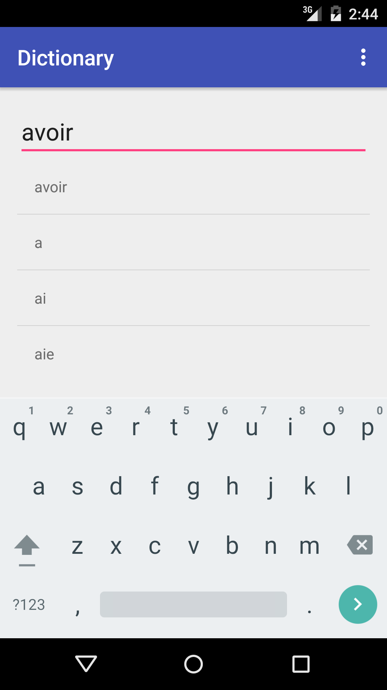
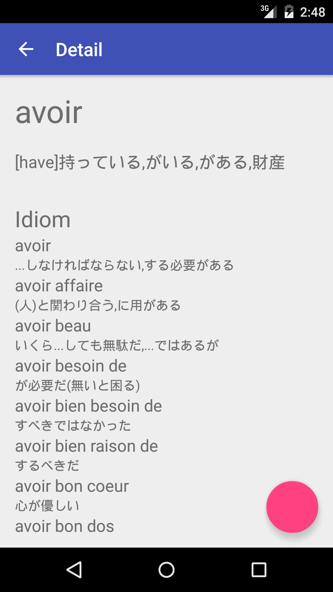

# f2jdic-android
Simple offline french to japanese dictionary. 

Database file is based on [f2jdic](http://www.vector.co.jp/soft/win95/edu/se217092.html) by ICHIRO.

# Unimplemented..

* Tool bar
* Menu interface
* Editing mode

# Screenshots



# Usage

To create sqlite3 database file, in f2jdic directory

```
sh ./init.sh
```

dict.sqlite3 is created in f2jdic/ and f2jdic-android/app/src/main/assets/ if you need.
In init.sh, convert.rb is called to extract necessary data from frU.csv. init.sh execute character-substitution for those were failed in char-code conversion. Then, import and create tables by import.sql.
